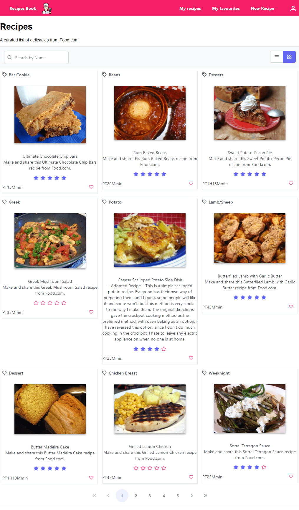

# yummy-reactive-ng

a recipe app built with sqlite, .NET core, Ef core, angular, primeng and more.



## start the server

From rezept-api/Api folder, run

```
dotnet run
```

Migrations are moved to Rezept.Data.Migrations

After changing entities, run (from the Api project directory)

```
dotnet ef migrations add <migration_name> --project ../Rezept.Data.Migrations
```

to update the database ->

```
dotnet ef database update
```

## start the client

from rezept-app

```
ng serve
```

